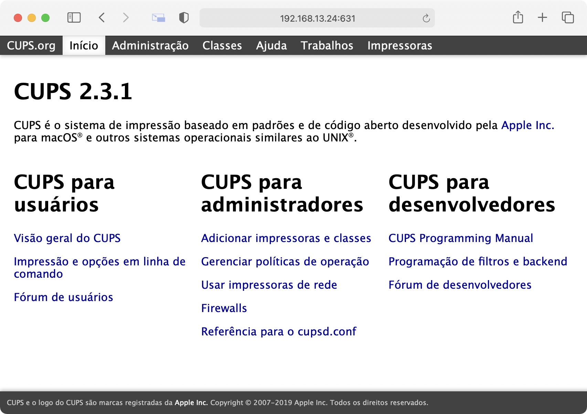

# AirPrintCups-Pi
AirPrint for Raspberry Pi (or other with Ubuntu's based distro).

This repository was built on Ubuntu 20.04.2 LTS for Raspberry Pi 3. Not tested on other architectures. It should work on all systems based on this distro also on x86 architectures. 

This script installs several drivers from different printers and manufacturers to make it most compatible as possible.

## Install guide

- Make sure GIT is installed on your system.
	```shell
	apt install git
	```
- Clone this repository. 
	```shell
	git clone git@github.com:oliveira131/AirPrintCups-Pi.git
	```
- Enter the cloned repository folder.
	```shell
	cd AirPrintCups-Pi
	```
- Add a executable permission to *install.sh* script.
	```shell
	chmod +x install.sh
	```
- Execute the install script.
	```shell
	sudo ./install.sh
	```

## Configuration guide

You can configure almost any compatible printer with CUPS.

- After install, access on your browser the IP and 631 port to get access to CUPS Administration page.
	
- Click on Administration menu link
	
- Click in Add Printer button
	
- Select your print in the list
	
- Check the "Share this Printer" and click in Continue. You can modify printer informations, if you desire.
	
- Now you have the select a correct driver to you printer. In most of cases this selection is automatic but you can modify or use a different PPD.
	
- After the driver selection, you go to General Options of print. Make sure that's all are ok and click on Set Default Options (you can modify )
	
- Conglaturations! Your printer is ready to print on AirPrint support!!!
	